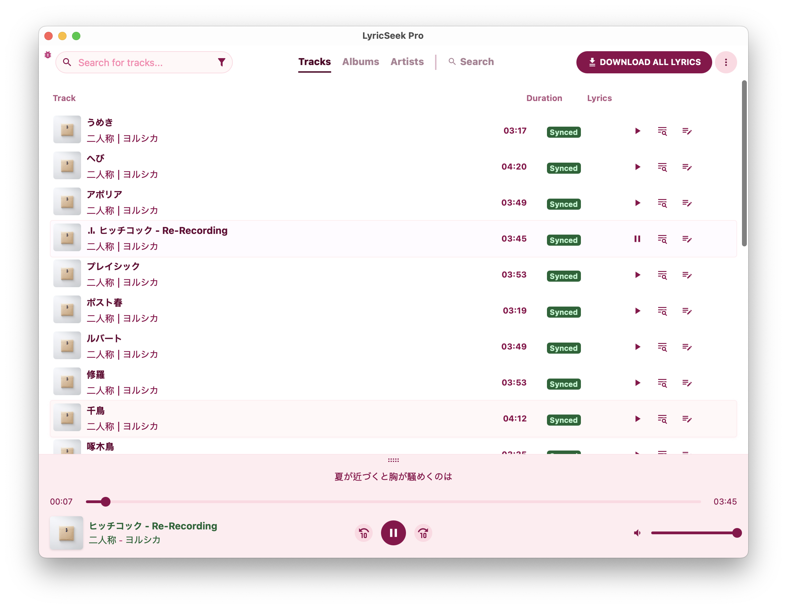

<p align="center">
	<a href="https://github.com/york9675/LyricSeek-Pro/releases" target="_blank">
		
	</a>
	<a href="#license" target="_blank">
		
	</a>
	<a>
		
	</a>
	<a>
		
	</a>
	<a>
		
	</a>
</p>



LyricSeek Pro is a desktop utility for downloading synced or plain lyrics for your offline music library.

It scans tracks in your selected directory and saves lyrics beside each song, with support for multiple providers including LRCLIB, NetEase, SimpMusic, and Genius.

> [!Note]\
> This project is a modified version of the original [LRCGET](https://github.com/tranxuanthang/lrcget) app.

> [!Important]\
> The stable branch is [`release`](https://github.com/york9675/LyricSeek-Pro/tree/release). The [`main`](https://github.com/york9675/LyricSeek-Pro/tree/main) branch may contain in-progress or unstable development changes.

## Table of Contents

<details>
  <summary>Click to expand</summary>
  
- [Features](#features)
- [Download](#download)
    - [Windows](#windows)
    - [Linux](#linux)
    - [macOS](#macos)
- [How To Use](#how-to-use)
- [Screenshots](#screenshots)
- [Credit](#credit)
- [Support & Sponsorship](#support--sponsorship)
- [Troubleshooting](#troubleshooting)
    - [Audio cannot be played in Linux (Ubuntu and other distros)](#audio-cannot-be-played-in-linux-ubuntu-and-other-distros)
    - [App will not open in Windows 10/11](#app-will-not-open-in-windows-1011)
    - [Scrollbar is invisible in Linux (KDE Plasma 5/6)](#scrollbar-is-invisible-in-linux-kde-plasma-56)
- [Development](#development)
- [Building](#building)
- [License](#license)
- [Star History](#star-history)

</details>

---

## Features

- Automatic library scanning and batch lyric fetching
- Support for synced lyrics (LRC) and plain text lyrics
- Multiple lyric sources: LRCLIB, NetEase, SimpMusic, Genius
- Built-in player for quick preview
- Search and edit tools for correcting or replacing lyrics
- Cross-platform desktop builds via Tauri (Windows, Linux, macOS)
- And more!

## Download
<p>
	<a href="https://github.com/york9675/LyricSeek-Pro/releases" target="_blank">
		
	</a>
</p>

Get the latest version from the [releases page](https://github.com/york9675/LyricSeek-Pro/releases).

### Windows

Download one of these assets from the latest release
- `LyricSeek.Pro_x.x.x_x64-setup.exe` - Standard installer (recommended for most users).
- `LyricSeek.Pro_x.x.x_x64_en-US.msi` - Windows Installer package

### macOS

Download the DMG that matches your device
- `LyricSeek.Pro_x.x.x_aarch64.dmg` - For Apple Silicon based Macs
- `LyricSeek.Pro_x.x.x_x64.dmg` - For Intel based Macs

### Linux

Linux assets in releases include
- `LyricSeek.Pro_x.x.x_amd64.AppImage` - Portable app, no installation required.
- `lyricseek-pro_x.x.x_amd64.deb` - For Debian/Ubuntu and other Debian-based distros.
- `lyricseek-pro-x.x.x-1.x86_64.rpm` - For Fedora/RHEL/openSUSE and other RPM-based distros.

## How To Use

1. Choose your music directory.
2. Scan your library.
3. Select a strategy and provider.
4. Download or edit lyrics as needed.

## Screenshots


## Credit

Special thanks to [LRCLIB](https://lrclib.net), the open lyrics API that powers a core part of lyric search in LyricSeek Pro.

Also credit to the original [LRCGET](https://github.com/tranxuanthang/lrcget) project, which this app is based on.

And other lyric providers including NetEase, SimpMusic, and Genius for their contributions to the lyric ecosystem.

Last but not least, thanks to users and contributors who provide feedback, report issues, and help improve the app!

## Support & Sponsorship

If you feel this project makes your campus life more beautiful and smoother, feel free to give this project a ⭐️!

This is an open-source project I independently develop and maintain in my spare time. If this tool helps you, you are welcome to buy me a coffee using the button below. Your support is my biggest motivation to keep maintaining it!

<a href="https://www.buymeacoffee.com/york0524"> </a><br><br>

## Troubleshooting

### Audio cannot be played in Linux (Ubuntu and other distros)

Install pipewire-alsa. Example for Ubuntu or Debian-based systems:

```sh
sudo apt install pipewire-alsa
```

### App will not open in Windows 10/11

LyricSeek Pro depends on WebView2. If you use Windows 10 LTSC or removed Edge/WebView2 components, reinstalling Microsoft Edge can resolve startup issues.

### Scrollbar is invisible in Linux (KDE Plasma 5/6)

Go to System Settings > Appearance > Global Theme > Application Style > Configure GNOME/GTK Application Style, then switch from breeze to another GTK style (for example, Adwaita or Default).

## Development

LyricSeek Pro is built with [Tauri](https://tauri.app).

Complete platform prerequisites from the Tauri docs:
[https://tauri.app/v1/guides/getting-started/prerequisites](https://tauri.app/v1/guides/getting-started/prerequisites)

Start development:

```sh
cd LyricSeek-Pro
npm install
npm run tauri dev
```

## Building

Create production builds:

```sh
cd LyricSeek-Pro
npm install
npm run tauri build
```

Build outputs are generated under:

```txt
./src-tauri/target/release/
```

For detailed platform packaging instructions, see:
[https://tauri.app/v1/guides/building/](https://tauri.app/v1/guides/building/)

## License

This project is licensed under the MIT License. See [LICENSE](LICENSE) for details.

## Star History

[](https://star-history.com/#york9675/LyricSeek-Pro&Date)

---

© 2026 York Development

Made with :heart: in Taiwan.

Based on [LRCGET](https://github.com/tranxuanthang/lrcget) project.